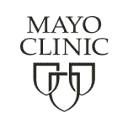
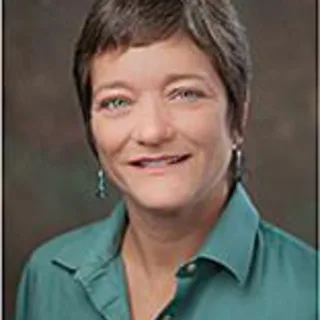
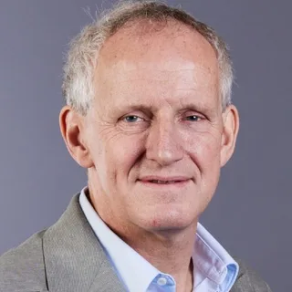
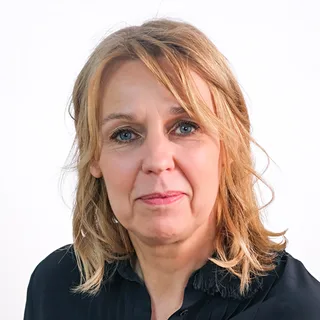
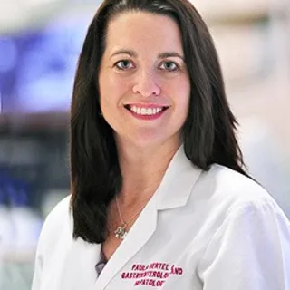
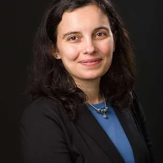
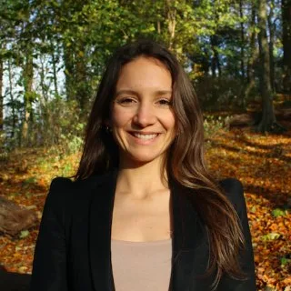
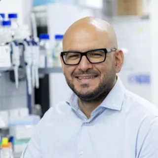

# PFIC doctors, researchers, and centers for family discussion

Reviewed: 2026-05-23

HTML companion: [layperson-pfic-specialists-and-centers.html](../html/layperson-pfic-specialists-and-centers.html)

This is a family-facing research guide. It is not medical advice and does not rank hospitals as "best." PFIC4 is rare, so the practical question is which programs have the strongest public evidence of PFIC, genetic cholestasis, pediatric hepatology, liver transplant, research-network, and second-opinion experience.

Scope: this guide is for finding PFIC4/TJP2-relevant expertise. Broader PFIC or genetic-cholestasis signals are included only when public PFIC4-specific volume or experience is not visible.

Related files:

- [Clinician specialist brief](clinician-pfic-specialists-and-centers.md) / [HTML](../html/clinician-pfic-specialists-and-centers.html)
- [Layperson PFIC4 guide](layperson-pfic4-guide.md) / [HTML](../html/layperson-pfic4-guide.html)
- [Clinician PFIC4 brief](clinician-pfic4-brief.md) / [HTML](../html/clinician-pfic4-brief.html)
- [Treatment escalation guide](layperson-treatment-escalation.md) / [HTML](../html/layperson-treatment-escalation.html)
- [TJP2 gene guide](layperson-tjp2-gene-guide.md) / [HTML](../html/layperson-tjp2-gene-guide.html)
- [Combined packet](pfic4-research-packet.md) / [HTML](../html/pfic4-research-packet.html)
- [Source index](source-index.md) / [HTML](../html/source-index.html)

## How to read this

For PFIC4/TJP2, a "leading" person or hospital should have public evidence in at least one of these buckets:

- PFIC-specific clinical or research work, not just general liver disease.
- Pediatric hepatology plus liver transplant experience.
- Genetic cholestasis testing or variant-interpretation expertise.
- Participation in PFIC trials, ChiLDReN/LOGIC, NAPPED, TreatFIC, PFIC Network, or similar rare-liver collaborations.
- Published PFIC, TJP2, cholestasis, bile-acid, IBAT-inhibitor, biliary diversion, transplant, or HCC-surveillance work.
- A practical pathway for consultation or second opinion.

The PFIC Network hospital directory is the best starting map because it is PFIC-specific. It also includes an important warning: the list is not exhaustive, and PFIC Network says it cannot validate every listed program's experience. Use it as a shortlist generator, then verify the individual program.

## Programs with the strongest public PFIC signal

These are programs to evaluate, not a formal ranking.

| Logo | Program | Main location | Why it stands out publicly | What to ask |
| --- | --- | --- | --- | --- |
|  | Cincinnati Children's Undiagnosed and Rare Liver Disease Center / PFIC Research Center | Cincinnati, Ohio, United States | The center publicly says its vision is leadership in PFIC diagnosis, care, and research. It describes a PFIC clinic goal, patient registry, translational research, clinical trials, a large hereditary liver gene panel, iPSC/liver organoid/zebrafish/mouse work, and variant validation. Named team includes Akihiro Asai, William Balistreri, Chunyue Yin, and ChiLDReN site PI Alexander Miethke. | Ask whether they provide PFIC4/TJP2 second opinions, how they review variants, whether they can coordinate with the local hepatologist, and whether any registry or study is appropriate. |
|  | King's College Hospital / King's College London Institute of Liver Studies | London, England, United Kingdom | Richard Thompson's group helped identify `TJP2` as a PFIC4 gene and King's has a Liver Molecular Genetics laboratory tied to clinical hepatology. The lab is described as co-located with clinical staff and linked to multidisciplinary patient management. | Ask whether the pediatric or adult pathway fits the patient's age, whether they review genetic reports internationally, and whether their liver genetics service can advise on TJP2 variant interpretation. |
|  | University Medical Center Groningen / Beatrix Children's Hospital | Groningen, Netherlands | Henkjan Verkade and collaborators initiated NAPPED and TreatFIC, two major PFIC natural-history and outcomes efforts. Public materials describe work in familial cholestatic syndromes, enterohepatic circulation, transplant, and PFIC prognosis/treatment response. | Ask whether TreatFIC enrollment or research consultation is possible and whether they have PFIC4-specific treatment-response experience. |
|  | Bicetre Hospital / AP-HP Paris-Saclay rare pediatric liver disease network | Le Kremlin-Bicetre / Paris area, France | Filfoie lists Bicetre as the coordinating reference center for biliary atresia and genetic cholestasis in France, with pediatric hepatology, liver transplantation, surgery, radiology, endoscopy, intensive care, pathology, biochemistry, toxicology, virology, and molecular biology support. Emmanuel Gonzales coordinates the French rare pediatric liver disease network. | Ask about PFIC4/TJP2 experience, French or international second-opinion pathways, and whether genetics/pathology review is available. |
|  | Children's Hospital Colorado Pediatric Liver Center | Aurora, Colorado, United States | PFIC Network lists the center, and Ron Sokol chairs the PFIC Network Scientific Medical Advisory Board. ChiLDReN lists Children's Colorado as a clinical site, with Sokol as network chair/site PI. | Ask about PFIC4 monitoring, HCC surveillance policy, transplant timing, nutrition support, and participation in LOGIC/rare-liver studies. |
|  | Texas Children's Hospital / Baylor College of Medicine | Houston, Texas, United States | PFIC Network advisory-board materials list Benjamin Shneider, and ChiLDReN lists Texas Children's as a site. Shneider's public profile emphasizes bile-acid transport, intrahepatic cholestasis, and pediatric cholestasis clinical studies. Paula Hertel is publicly described as caring for PFIC and working with ChiLDReN PFIC analysis/publication efforts. | Ask whether the visit should be with hepatology, transplant hepatology, or the Liver Center, and whether their team has PFIC4/TJP2-specific experience. |
|  | UPMC Children's Hospital of Pittsburgh | Pittsburgh, Pennsylvania, United States | PFIC Network lists James Squires on the advisory board and Children's Pittsburgh in the directory. ChiLDReN lists Pittsburgh as a site; Patrick McKiernan's public profile notes inherited metabolic liver disease, transplant hepatology, and PEDFIC 1 principal-investigator work. | Ask about PFIC medical therapy, transplant hepatology, biliary diversion experience, and trial/registry options. |
|  | The Hospital for Sick Children / University of Toronto | Toronto, Ontario, Canada | PFIC Network lists SickKids. ChiLDReN lists SickKids as a site with Binita Kamath and Simon Ling. SickKids clinicians were also part of the original TJP2/PFIC4 discovery author group. | Ask about pediatric hepatology second opinions, transition to adult care, and whether they can coordinate genetics and surveillance recommendations. |
|  | UCSF Benioff Children's Hospital / UCSF | San Francisco, California, United States | PFIC Network lists UCSF. Laura Bull, a PFIC Network advisory-board member, is a UCSF professor whose research focuses on genetic causes and manifestations of pediatric and pregnancy-related cholestasis. UCSF is also listed as a ChiLDReN site. | Ask whether the need is clinical hepatology, liver genetics research input, or both. |
| No single logo | Children's Hospital Los Angeles, CHOP, Seattle Children's, Riley/Indiana, Lurie Chicago, Children's Healthcare of Atlanta, Primary Children's/University of Utah, Saint Louis University/Cardinal Glennon | Los Angeles, Philadelphia, Seattle, Indianapolis, Chicago, Atlanta, Salt Lake City, and St. Louis, United States | These are PFIC Network directory entries marked with an asterisk, meaning participation in PFIC-specialized research networks according to the directory. Several are also ChiLDReN sites. | Ask what PFIC-specific care is available locally, whether they have transplant and nutrition support, and whether they can enroll or refer to research networks. |
|  | Mayo Clinic Pediatric Liver Clinic | Rochester, Minnesota, United States | Mayo publicly describes a multidisciplinary pediatric liver clinic, advanced hepatology/transplant care, living-donor transplant capability, transition to adult hepatology, and treatment of familial intrahepatic cholestasis conditions. Its PFIC-specific public signal is less strong than the PFIC-dedicated centers above, but it is a reasonable program to evaluate if geography, insurance, or transition-to-adult needs fit. | Ask directly how many PFIC/TJP2 patients they follow and who handles genetic cholestasis second opinions. |

## Leading doctors and researchers to know

This list means "publicly visible PFIC or genetic cholestasis leadership," not "the only good doctors."

| Photo | Person | Public role | Main location | Why they are relevant |
| --- | --- | --- | --- | --- |
|  | Richard J. Thompson, MD/PhD | King's College London / King's College Hospital | London, England, United Kingdom | Coauthor on the foundational TJP2/PFIC4 discovery paper; professor of molecular hepatology; leads liver molecular genetics work tied to clinical hepatology; PFIC Network advisory-board member and PFIC genetics educator. |
|  | Laura N. Bull, PhD | UCSF | San Francisco, California, United States | Coauthor on the foundational TJP2/PFIC4 discovery paper; studies genetic causes and manifestations of pediatric and pregnancy-related cholestasis; PFIC Network advisory-board member. |
|  | Ronald J. Sokol, MD | Children's Hospital Colorado | Aurora, Colorado, United States | Chair of the PFIC Network Scientific Medical Advisory Board; longtime leader in pediatric cholestasis research; ChiLDReN leadership; Children's Colorado PFIC and Pediatric Liver Center signal. |
|  | Henkjan J. Verkade, MD, PhD | University Medical Center Groningen | Groningen, Netherlands | Initiated NAPPED with Bettina Hansen and later TreatFIC; major public PFIC natural-history, prognosis, treatment-response, and transplant/outcomes signal. |
|  | Bettina Hansen, PhD | University of Toronto / Erasmus MC context in NAPPED publications | Toronto, Canada / Rotterdam, Netherlands research context | Key NAPPED/TreatFIC collaborator; important for PFIC natural-history and outcomes methodology. |
|  | Akihiro Asai, MD, PhD | Cincinnati Children's | Cincinnati, Ohio, United States | PFIC disease-modeling researcher using iPSC-derived hepatocytes and preclinical models; publicly connected to PFIC4/TJP2 modeling and future-treatment work. |
|  | Chunyue Yin, PhD | Cincinnati Children's | Cincinnati, Ohio, United States | Liver biology, cholestasis, and molecular genetics researcher at Cincinnati's rare liver disease center. |
|  | Alexander G. Miethke, MD | Cincinnati Children's | Cincinnati, Ohio, United States | ChiLDReN site PI at Cincinnati; medical director of liver transplant; research includes genetic causes of pediatric liver disease and fibrosis biomarkers. |
| No local headshot found | Emmanuel Gonzales, MD, PhD | Bicetre Hospital / Paris-Saclay | Le Kremlin-Bicetre / Paris area, France | Pediatric hepatologist in genetic cholestatic disease; coordinates French rare pediatric liver disease network; coauthor of PFIC diagnosis/treatment opinion work. |
| No local headshot found | Emmanuel Jacquemin, MD | Bicetre Hospital / Paris-Saclay | Le Kremlin-Bicetre / Paris area, France | Senior pediatric hepatology and transplant leader in the French genetic cholestasis network; associated with Bicetre reference-center expertise. |
|  | Benjamin L. Shneider, MD | Texas Children's / Baylor | Houston, Texas, United States | PFIC Network advisory-board member; bile-acid transport and intrahepatic cholestasis researcher; ChiLDReN site PI; pediatric hepatology leader. |
|  | Paula Hertel, MD | Texas Children's / Baylor | Houston, Texas, United States | PFIC clinician-researcher visible through PFIC Network educational work and ChiLDReN PFIC analysis/publication efforts. |
| No local headshot found | James E. Squires, MD, MS | UPMC Children's Hospital of Pittsburgh | Pittsburgh, Pennsylvania, United States | PFIC Network advisory-board member; pediatric transplant hepatologist; ChiLDReN co-investigator; Starzl Network liver-transplant quality leader. |
| No local headshot found | Patrick J. McKiernan, MD | UPMC Children's Hospital of Pittsburgh | Pittsburgh, Pennsylvania, United States | Director of hepatology; inherited metabolic liver disease and transplant interest; public PEDFIC 1 site PI record. |
|  | Binita M. Kamath, MBBChir, MRCP, MTR | SickKids / University of Toronto | Toronto, Ontario, Canada | ChiLDReN site PI and original TJP2/PFIC4 discovery author; pediatric hepatology and rare cholestasis research signal. |
| No local headshot found | Simon Ling, MBChB | SickKids / University of Toronto | Toronto, Ontario, Canada | ChiLDReN site PI and original TJP2/PFIC4 discovery author; pediatric hepatology signal. |
|  | Silvia Vilarinho, MD, PhD | Yale | New Haven, Connecticut, United States | PFIC Network advisory-board member; physician-scientist using genetics/genomics to solve unexplained liver disease; adult PFIC education role. |
| No local headshot found | Gitta Lubke, PhD | PFIC Network science advisor | PFIC Network / remote registry role | Leads/supports PFIC Network patient registry and patient-centered research infrastructure. |
|  | Antonia Felzen, MD/PhD candidate | UMC Groningen | Groningen, Netherlands | NAPPED researcher and TreatFIC co-founder; focused on rare genetic liver disease and PFIC natural history in the medication era. |
|  | Pasquale Piccolo, PhD | TIGEM | Pozzuoli, Italy | PFIC Network 2024 small-grant recipient for PFIC3 genome-editing work; not PFIC4-specific but relevant to root-cause PFIC therapy direction. |

## Recent research in plain English

- `TJP2`/PFIC4 remains a small-cohort disease. The major theme is variability: the same or similar gene category can produce different ages of onset, different progression speeds, and different cancer-surveillance concerns.
- The 2024 MARCH-PFIC trial strengthened evidence for maralixibat across PFIC and included a small PFIC4/TJP2 subgroup. That is direct PFIC4 inclusion, but not large PFIC4-only proof.
- Odevixibat is PFIC-labeled and supported by PFIC trials, but the pivotal randomized trial was PFIC1/PFIC2. PFIC4 use is therefore broader-label and extrapolated unless a treating team cites additional patient-level data.
- 2025 and 2026 reviews emphasize that genetic diagnosis matters early because genotype can affect prognosis, transplant timing, cancer surveillance, and likely response to bile-acid-recirculation strategies.
- The 2025 PFIC4 missense-variant paper added another reminder that PFIC4 cannot be safely predicted from symptoms alone; close monitoring matters even when one patient appears milder.
- Patient-centered PFIC research is moving toward real-world comparisons: medications, surgeries, nutrition, mental health/itch support, insurance burden, and outcomes families actually feel, such as sleep, school, skin injury, caregiver quality of life, and financial stress.
- Root-cause therapy is still research-stage. Current approved drugs reduce bile-acid burden and itch; they do not repair `TJP2`.

## How to choose who to contact first

Start with practical constraints, then expertise:

- Geography and insurance.
- Pediatric vs adult care fit.
- Whether the child already has transplant-center access.
- Whether the main question is PFIC4 treatment response, genetic interpretation, HCC surveillance, biliary diversion, transplant timing, or research enrollment.
- Whether the center can coordinate a second opinion without taking over all care.

For a PFIC4/TJP2 second opinion, a strong request packet would include:

- Genetic report with exact `TJP2` variants and inheritance if known.
- Current and historical serum bile acids, bilirubin, AST/ALT, GGT, INR, albumin, platelets, AFP.
- Growth chart, fat-soluble vitamin levels, medication history, and pruritus/sleep log.
- Ultrasound, elastography/FibroScan, MRI/MRCP if done, biopsy/pathology if done.
- Current medication dose, diarrhea/dehydration issues, and treatment-response timeline.

## Sources used

- PFIC Network Global PFIC Hospital Directory: https://www.pfic.org/pfic-hospital-directory/
- PFIC Network Scientific Medical Advisory Board: https://www.pfic.org/about-pfic-network/pfic-medical-advisory-board/
- Cincinnati Children's Undiagnosed and Rare Liver Disease Center: https://www.cincinnatichildrens.org/research/divisions/u/undiagnosed-rare-liver-disease
- Cincinnati rare liver disease team and programs: https://www.cincinnatichildrens.org/research/divisions/u/undiagnosed-rare-liver-disease/team and https://www.cincinnatichildrens.org/research/divisions/u/undiagnosed-rare-liver-disease/programs
- King's College London Liver Molecular Genetics and Pediatric Hepatology/Rare Diseases pages: https://www.kcl.ac.uk/research/liver-molecular-genetics and https://www.kcl.ac.uk/research/paediatric-hepatology-rare-diseases
- ChiLDReN participating centers and LOGIC study pages: https://childrennetwork.org/About-The-Network/Participating-Centers and https://repository.niddk.nih.gov/network/177
- Filfoie rare liver disease expert centers: https://en.filfoie.com/rare-liver-diseases-expert-centers/
- PFIC Network webinars and conference materials: https://www.pfic.org/learn-about-pfic-disease/pfic-webinar-series/
- MARCH-PFIC maralixibat trial: https://pubmed.ncbi.nlm.nih.gov/38723644/ and https://clinicaltrials.gov/study/NCT03905330
- Pediatric cholestatic diseases in the era of IBAT inhibitors, 2026: https://www.mdpi.com/2036-7503/18/1/19
- Genotypes and clinical variants in PFIC review: https://pmc.ncbi.nlm.nih.gov/articles/PMC11846186/
- PFIC4 missense variant and phenotypic variability, 2025: https://www.nature.com/articles/s10038-025-01338-w
- PFIC Network Project IMPACT / roadmap pages: https://www.pfic.org/project-impact/ and https://impactroadmap.pfic.org/pfic-patient-centered-cer-priorities/

## Unresolved questions

- Which centers currently provide remote PFIC4/TJP2 second opinions, and which require in-person visits?
- Which centers have direct experience with the patient's exact `TJP2` variant or variant class?
- Whether the treating team wants a one-time second opinion, ongoing co-management, trial/registry enrollment, or transplant evaluation.
